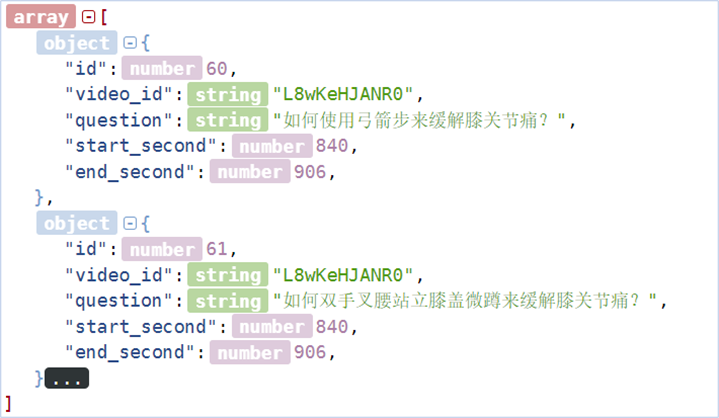

# Shared Task 5 in NLPCC 2023: Chinese Medical Instructional Video Question Answering
The Chinese medical instructional video question answering aims at performing the temporal answer grounding task given a medical-related question in a single video or the video corpus. Those videos are collected from high-quality Chinese medical [Youtube](https://www.youtube.com/) channels and annotated by Chinese medical experts.

## Table of Contents
- [Background](#background)
- [Task Overview](#task_overview)
  - [Track 1. Temporal Answer Grounding in Singe Video (TAGSV)](#track1)
  - [Track 2. Video Corpus Retrieval (VCR)](#track2)
  - [Track 3. Temporal Answer Grounding in Video Corpus (TAGVC)](#track3)
- [Dataset](#dataset)
- [Evaluation](#evaluation)
- [Participation](#participation)
- [Award](#award)
- [Important Dates](#important_dates)
- [Reference](#reference)

## Background 
Recently, the availability of online videos has revolutionized the way to access information or gain knowledge [1]-[2]. Many people find instructional videos to be an effective and efficient way to teach or learn how to accomplish a particular task with a series of step-by-step procedures [3]-[4]. To this end, a new task temporal answer grounding in the Chinese Medical instructional video (TAGV) is proposed to find the video frame span corresponding to an input question. The ultimate goal for this shared task is to develop a system that can provide temporal answer video segments for the first-aid, medical emergency, or medical education.
## <a id="task_overview">Task Overview</a>
This shared task includes three tracks: Temporal Answer Grounding in Singe Video (TAGSV), Video Corpus Retrieval (VCR) and Temporal Answer Grounding in Video Corpus (TAGVC).

<b>Fig. 1: Illustration of Temporal Answer Grounding in Singe Video (TAGSV).</b></a>

* **Track 1. Temporal Answer Grounding in Singe Video (TAGSV)**: As shown in Fig. 1: given a medical or health-related question and a single untrimmed Chinese medical instructional video, this track aims to locate the temporal answer (start and end time points) within the video.

<b>Fig. 2: Illustration of Video Corpus Retrieval (VCR).</b></a>

* **Track 2. Video Corpus Retrieval (VCR)**: As shown in Fig. 2, given a medical or health-related question and a large collection of untrimmed Chinese medical instructional videos, this track aims to find the most relevant video corresponding to the given question in the video corpus.

<b>Fig. 3: Illustration of Temporal Answer Grounding in Video Corpus (TAGVC).</b></a>

* **Track 3. Temporal Answer Grounding in Video Corpus (TAGVC)**: As shown in Fig. 3, given a text question and a large collection of untrimmed Chinese medical instructional videos, this track aims at finding the matching video answer span within the most relevant video corresponding to the given question in the video corpus.
## Dataset 

<b>Fig. 4: Dataset examples of the TAGV shared task.</b></a>

The videos for this competition are crawled from the Chinese medical instructional channels on the YouTube website, where the subtitles (in Chinese) are transcribed from the corresponding video. The question and corresponding temporal answer are manually labeled by annotators with the medical background. Each video may contain several question-answer pairs, where each question corresponds to a unique answer. The dataset is split into a training set, a validation set, and a test set. During the competition, the test set along with the true “id” data number is not available to the public. The Fig. 4 shows the dataset examples for the TAGV shared task. The “id” is the sample number which is used for the video retrieval track. The “video_id” means the unique ID from YouTube. The “question” item is written manually by the medical experts. The “start and end second” represent the temporal visual answer from the corresponding video.

* **Statistics**

| Dataset | Videos  | QA pairs | Vocab Nums | Question Avg. Len. | Video Avg. Len. |
| ----- | ------ | ---------- | ------ | ------ | ------ |
| Train & Dev | 1,228 | 2,937  | 3,125 | 17.16 | 263.3 |
| Test A | 200  | 492     | 2,171 | 17.81   | 242.4 |
| Test B (To be published) | -  | -     | - | - | - |

* **Details**

Download all the Train & Dev files (videos, audios and subtitles) [BaiduNetDisk](https://pan.baidu.com/s/1VRJZaQyGn5PbyGt0yVo1Gg?pwd=9874) | [GoogleDrive](https://drive.google.com/drive/folders/1QbY8DEaVLkY2w6vOCWAs4ZQFHgJ3q8ui?usp=sharing)

**Note:** We will provide the baseline and the Test A daset soon, any original methods (language/vision/audio/mutlimodal etc.) are welcome.

## Evaluation
#### Track 1:
##### Temporal Answer Grounding in Singe Video
We will evaluate the results using the metric calculation equation shown as follows. Specifically, we use (1) Intersection over Union (IoU), and (2) mIoU which is the average IoU over all testing samples. Following the previous work [3]-[5], we adopt “R@n, IoU = μ”, and “mIoU” as the evaluation metrics, which treat localization of the frames in the video as a span prediction task. The “R@n, IoU = μ” denotes the Intersection over Union (IoU) of the predicted temporal answer span compared with the ground truth span, where the overlapping part is larger than “μ” in top-n retrieved moments. The “mIoU” is the average IoU over the samples. In our experiments, we use n = 1 and μ ∈ {0.3, 0.5, 0.7} to evaluate the TAGSV results. 

$$
\begin{aligned}
 \mathrm{IOU} & =\frac{A \cap B}{A \cup B}  \\
\mathrm{mIOU} & =\left(\sum_{i=1}^n \mathrm{IOU}\right) / n
\end{aligned}
$$

where A and B represent different spans. 
 
**Note:** The main ranking of this track is based on the mIoU score, and other metrics in this track are also provided for further analysis.

#### Track 2:

##### Video Corpus Retrieval 
Following the pioneering work [6], we adopt the video retrieval metric like “R@n”. Specifically, we adopt the n=1, 10, and 100 to denote the recall performance of the video retrieval. The Mean Reciprocal Rank (MRR) score to evaluate the Chinese medical instructional video corpus retrieval track, which can be calculated as follows.

$$
M R R=\frac{1}{|V|} \sum_{i=1}^{|V|} \frac{1}{\operatorname{Rank}_i} 
$$

where the |*V*| is the number of the video corpus. For each testing sample *V*i, the Ranki is the position of the target ground-truth video in the predicted list.
 
**Note:** The main ranking of this track is based on the Overall score. The Overall score is calculated by averaging the R@1, R@10, R@100 and MRR scores, which is shown as follows.

$$
\text { Overall }=\frac{1}{|M|} \sum_{i=1}^{|M|} \frac{1}{\text { Value}_i}
$$

where the |*M*| is the number of the evaluation metrics. Valuei is the i-th metric in the above metrics (R@1, R@10, R@100 and MRR), |M|=4.
#### Track 3:

##### Temporal Answer Grounding in Video Corpus
We kept the Intersection over Union (IoU) metric similar to the Track 1 and the retrieval indexes “R@n, n=1/10/100” and MRR similar to Track 2 for further analysis. The “R@n, IoU = 0.3/0.5/0.7” is still used, where we assign the n = 1, 10, 100 for evaluation. The index of mean IoU in video retrieval subtask, i.e., “R@1/10/100|mIOU”, is also adopted for measuring the average level of participating model’s performance. 
 
**Note:** The main ranking of this track is based on the Average score. The Average score is calculated by averaging the R@1|mIoU, R@10|mIoU, R@100|mIoU scores, which is shown as follows.

$$
\text { Average }=\frac{1}{|M'|} \sum_{i=1}^{|M'|} \frac{1}{\text { Value}_i}
$$

where the |M'| is the number of the evaluation metrics. Valuei is the value of the i-th metric (i.e., R@1|mIoU, R@10|mIoU, R@100|mIoU), |M'|=3.

## Participation
If you are interested in our challenge, please fill out the [application form](http://tcci.ccf.org.cn/conference/2023/dldoc/NLPCC2023.SharedTask5.RegistrationForm.doc) and email libinincn@hnu.edu.cn (Please email us with your organization's email and note that you participate in the challenge). The dataset will be sent to you by then. 

## Award
The top 3 participating teams will be certificated by NLPCC and CCF-NLP, as well as awarded cash rewards.

The first prize (*1): ￥3000 

The second prize (*1): ￥2000

The third prize (*1): ￥1000

## <a id="important_dates"> Important Dates</a>
Announcement of shared tasks and call for participation: 2023/3/15

- [x] Registration open:	2023/3/15

- [x] Release of detailed task guidelines & training data:	2023/4/3

- [ ] Release Test A data:	2023/4/10

- [ ] Registration deadline: 2023/5/5

- [ ] Release the Test B:	2023/5/21

- [ ] Participants’ final result submission (Test B) deadline: 2023/5/28

- [ ] Evaluation results release and call for system reports and conference paper: 2023/6/10

- [ ] Conference paper submission deadline (only for shared tasks): 2023/6/30

- [ ] Conference paper accept/reject notification: 2023/7/18

- [ ] Camera-ready paper submission deadline:	2023/8/1

All deadlines are 11.59 pm in UTC-8 ("Beijing Time"). For more details, please refer to the email notification.
## Reference
[1]  *Li, Bin*, *et al.* “Towards visual-prompt temporal answering grounding in medical instructional video.” *arXiv preprint arXiv:2203.06667 (2022).*

[2]  *Weng, Yixuan, and Bin Li.* “Visual Answer Localization with Cross-modal Mutual Knowledge Transfer.” arXiv preprint arXiv:2210.14823. (*Accepted in ICASSP 2023*).

[3]  *Deepak Gupta, Kush Attal, and Dina Demner-Fushman.* “A Dataset for Medical Instructional Video Classification and Question Answering.” *arXiv preprint arXiv:2201.12888, 2022.*

[4]  *Deepak Gupta, and Dina Demner-Fushman.* “Overview of the MedVidQA 2022 Shared Task on Medical Video Question-Answering*.* ” *BioNLP 2022@ ACL 2022 (2022): 264.*

[5]  *Zhang, Hao, et al.* “Natural language video localization: A revisit in span-based question answering framework.” *IEEE transactions on pattern analysis and machine intelligence 44.8 (2021): 4252-4266.*

[6]  *Li, Bin, et al.* "Learning to Locate Visual Answer in Video Corpus Using Question." arXiv preprint arXiv:2210.05423. (*Accepted in ICASSP 2023*).
